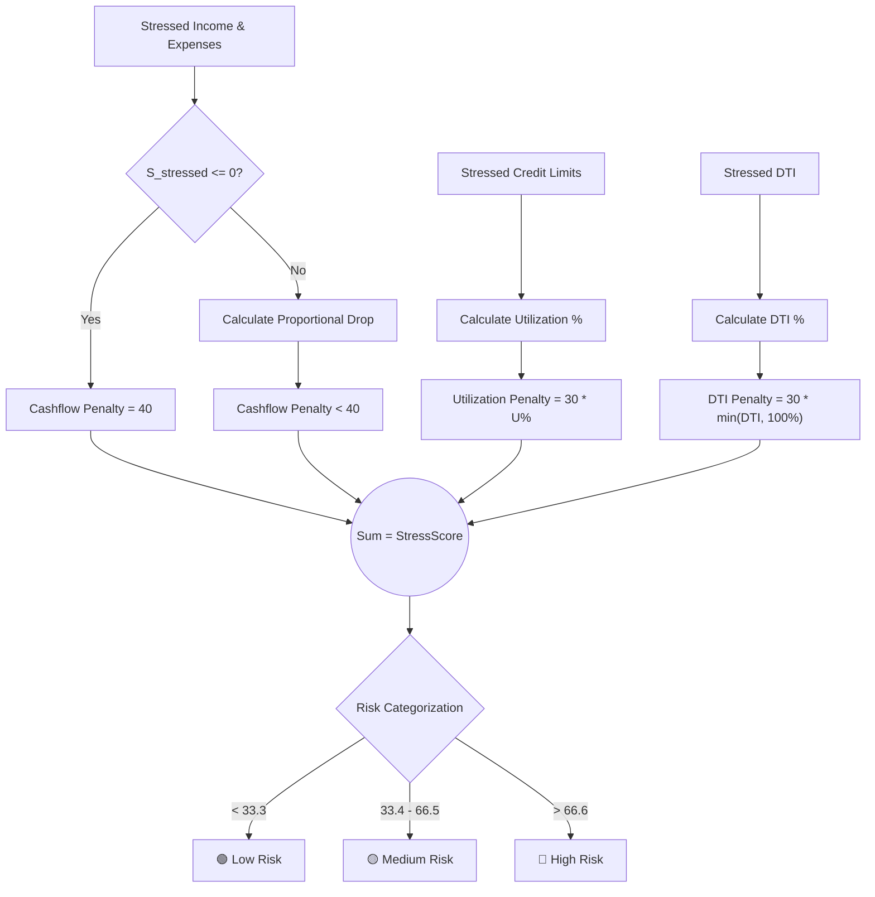

# 🏦 Comprehensive Credit Risk Stress-Testing Engine


## 📌 Executive Summary
This project implements an end-to-end, data-driven **Credit Risk Stress-Testing Pipeline** designed to simulate the impact of adverse macroeconomic shocks on a consumer loan portfolio. By applying configurable stress scenarios (e.g., sudden income drops, expenditure spikes, and credit utilization surges), the engine recalculates borrower cash flows and debt-to-income (DTI) ratios. 

It outputs a composite **StressScore (0-100)** to quantify financial vulnerability, automatically flags high default risks, and generates actionable credit memos for relationship managers. An interactive Streamlit dashboard is included for real-time visualization of portfolio-level exposure and demographic vulnerability.

---

## 🏗️ Project Architecture & Workflow

The system is highly modular and entirely **input-driven**. No hardcoding of shock values exists in the core logic; everything is parameterized through a central configuration file.

1. **Data Generation/Ingestion (`generate_dummy_data.py` & `load_clean.py`)**
   - Ingests raw consumer data (Income, Expenditure, EMI, Utilization, Age).
   - Standardizes data types and sanitizes Personally Identifiable Information (PII) for regulatory compliance.
2. **Stochastic Stress Engine (`stress_runner.py`)**
   - Reads macroeconomic shock parameters from `config.yaml`.
   - Computes stressed cashflows and recalculates post-shock DTI and utilization limits.
3. **Reporting Layer (`generate_reports.py`)**
   - Isolates the top 5% riskiest profiles.
   - Generates automated, one-line actionable memos (e.g., *"Immediate RM outreach; request updated income docs"*) for the top 20 critical accounts.
4. **Visualization (`dashboard/app.py`)**
   - A local web application serving real-time analytics, distribution charts, and actionable data tables.

---

## 🧮 The Mathematical Model

The engine calculates a proprietary **StressScore** ($\mathcal{S}$) composed of three weighted risk components: Cashflow ($\mathcal{C}$), Credit Utilization ($\mathcal{U}$), and Debt Burden ($\mathcal{D}$).

$$ \mathcal{S} = \mathcal{C} + \mathcal{U} + \mathcal{D} $$

Where $\mathcal{S} \in [0, 100]$.

### 1. Cashflow Penalty ($\mathcal{C}$) - 40% Weight
Evaluates the absolute drop in monthly savings ($S_{base}$ to $S_{stressed}$). If post-shock savings drop below zero, the maximum penalty is applied.

$$
\mathcal{C} = 
\begin{cases} 
40, & \text{if } S_{stressed} \le 0 \\ 
40 \times \left( \frac{\max(0, S_{base} - S_{stressed})}{S_{base} + 1} \right) + 1, & \text{if } S_{stressed} > 0 
\end{cases}
$$

### 2. Credit Utilization Penalty ($\mathcal{U}$) - 30% Weight
Evaluates the borrower's reliance on credit post-shock.

$$ \mathcal{U} = 30 \times \left( \frac{\text{Stressed Utilization}}{100} \right) $$

### 3. Debt Burden (DTI) Penalty ($\mathcal{D}$) - 30% Weight
Evaluates the proportion of new income dedicated to fixed EMI payments. Capped at 1.0 (100% DTI).

$$ \mathcal{D} = 30 \times \min\left( \frac{\text{Stressed DTI}}{100}, 1.0 \right) $$

### 📊 Scoring Logic Workflow



---

## ⚙️ Setup & Installation

Ensure you have Python 3.9+ installed on your system.

**1. Clone the repository**
```bash
git clone https://github.com/YOUR_USERNAME/credit-risk-stress-test.git
cd credit-risk-stress-test
```

**2. Install dependencies**
```bash
pip install -r requirements.txt
```
*(Dependencies include `pandas`, `numpy`, `streamlit`, `plotly`, `pyyaml`, and `pyarrow`)*

---

## 🚀 Usage Guide

### 1. Configure the Macroeconomic Scenario
Open `config.yaml` to set your desired economic shocks. Example of a severe recession scenario:
```yaml
income_shock_pct: -0.30        # 30% reduction in monthly income
expenditure_shock_pct: 0.20    # 20% inflation spike in living expenses
utilization_shock_pp: 10       # 10 percentage point increase in credit card usage
```

### 2. Run the Automated Pipeline
We have provided a bash script that handles data generation, cleaning, stress testing, and report generation in sequential order.
```bash
chmod +x run_all.sh
./run_all.sh
```

### 3. Launch the Interactive Dashboard
To view the results visually, spin up the Streamlit server:
```bash
streamlit run dashboard/app.py
```
This will open a browser window at `http://localhost:8501` where you can view portfolio KPIs, stress distributions, and download the generated reports directly.

---

## 📂 Output Artifacts
After running the pipeline, check the `outputs/` directory for:
- `stressed_full.csv`: The complete dataset with baseline and post-shock metrics appended.
- `summary_report.txt`: High-level mathematical summary of the run (useful for audit logging).
- `top_risk_5pct.csv`: Filtered subset of the most critical accounts.
- `top20_memos.csv`: Automated RM action items.
- `dashboard_data.parquet`: Compressed columnar data utilized by the Streamlit dashboard for rapid loading.
